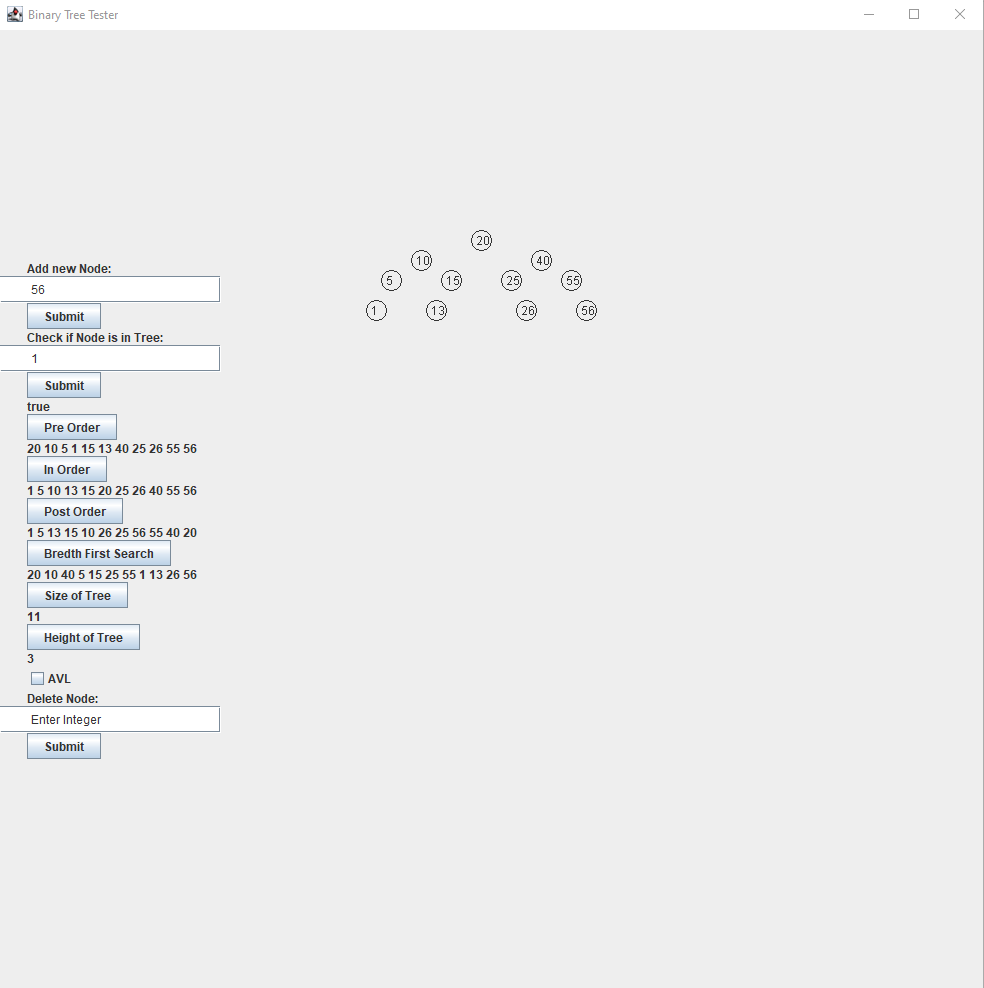
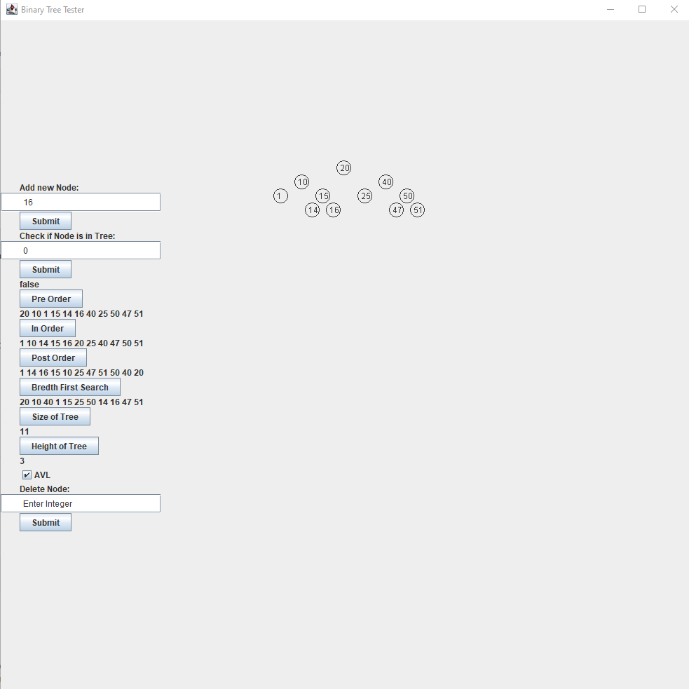

# Java-AVL-Visualizer

A simple program that generates a visulization of binary and AVL trees with common CRUD algorithms.

## Installation

1. Make sure you have Java 11 or later installed on your machine. You can download it from [here](https://www.oracle.com/java/technologies/javase-downloads.html).
2. Clone this repository or download the files directly from the repository.
3. Run the program by typing the following command in the terminal:
```terminal
javac BinaryTree.java
java BinaryTree
```

## Usage

- The program allows you to choose a tree type: Binary or AVL.
- The program can do the following:
  - Add node
  - Check if node exists
  - Pre Order Sort Nodes
  - In Order Sort Nodes
  - Post Order Sort Nodes
  - Bredth First Sort Nodes
  - Check Size of Tree
  - Check Height of Tree
  - Delete node

## Examples

### Binary Tree


### AVL Tree


## Additional Notes
 - DO NOT use anything but integers as inputs

## Contact

If you have any questions or feedback, please feel free to reach out to me at [email](mailto:elliotfayman@gmail.com)


